# Entity Relationship Diagram (ERD)
## School Equipment Portal - Visual Database Design

### 🎯 Visual Database Schema

```mermaid
erDiagram
    USER ||--o{ EQUIPMENT : creates
    USER ||--o{ EQUIPMENT : updates
    USER ||--o{ REQUEST : makes
    USER ||--o{ REQUEST : approves
    EQUIPMENT ||--o{ REQUEST : "is requested"

    USER {
        ObjectId _id PK
        string username UK "3-30 chars, alphanumeric"
        string email UK "valid email format"
        string password "hashed, min 6 chars"
        enum role "student|staff|admin"
        string firstName "required, max 50"
        string lastName "required, max 50"
        string studentId "sparse, required for students"
        string department "max 100 chars"
        boolean isActive "default true"
        date lastLogin "timestamp"
        string profilePicture "URL"
        date createdAt "auto-generated"
        date updatedAt "auto-updated"
    }

    EQUIPMENT {
        ObjectId _id PK
        string name "required, max 100"
        string description "max 500"
        enum category "Electronics|Sports|Laboratory|Audio_Visual|Computing|Tools|Other"
        enum condition "Excellent|Good|Fair|Poor|Out_of_Service"
        number totalQuantity "min 0"
        number availableQuantity "min 0, ≤ totalQuantity"
        string serialNumber UK "sparse"
        string brand "max 50"
        string model "max 50"
        date purchaseDate "purchase date"
        number purchasePrice "min 0"
        string location "max 100"
        boolean isActive "default true"
        string imageUrl "URL"
        string notes "max 1000"
        ObjectId createdBy FK
        ObjectId lastUpdatedBy FK
        date createdAt "auto-generated"
        date updatedAt "auto-updated"
    }

    REQUEST {
        ObjectId _id PK
        ObjectId requester FK
        ObjectId equipment FK
        number quantity "min 1"
        date requestDate "default now"
        date requestedStartDate "required"
        date requestedEndDate "required"
        date actualStartDate "nullable"
        date actualEndDate "nullable"
        enum status "pending|approved|rejected|borrowed|returned|overdue"
        string purpose "required, max 500"
        string notes "max 1000"
        ObjectId approvedBy FK
        date approvalDate "nullable"
        string rejectionReason "max 500"
        string returnNotes "max 500"
        boolean damageReported "default false"
        string damageDescription "max 1000"
        number penalty "min 0, default 0"
        date createdAt "auto-generated"
        date updatedAt "auto-updated"
    }
```

### 📊 Database Flow Diagram

### 🔄 Request Lifecycle State Diagram

### 🏗️ Database Architecture Layers

### 📈 Data Relationships Matrix

| Collection | Relationship Type | Related Collection | Foreign Key | Description |
|------------|------------------|-------------------|-------------|-------------|
| User | One-to-Many | Equipment | createdBy | User creates equipment |
| User | One-to-Many | Equipment | lastUpdatedBy | User updates equipment |
| User | One-to-Many | Request | requester | User makes requests |
| User | One-to-Many | Request | approvedBy | User approves requests |
| Equipment | One-to-Many | Request | equipment | Equipment has requests |

### 🔍 Query Optimization Strategy

### 📊 Performance Metrics

### 🔐 Security Architecture

### 🎓 M.Tech Project Considerations

This database design demonstrates:

1. **Professional Data Modeling**: Industry-standard ERD and relationship design
2. **Scalability**: Proper indexing and query optimization
3. **Security**: Authentication, authorization, and data validation
4. **Real-world Application**: Equipment lending is a common institutional need
5. **Complex Relationships**: Multiple entity relationships with business logic
6. **State Management**: Request lifecycle and status transitions
7. **Performance Optimization**: Strategic index placement and query patterns
8. **Documentation**: Comprehensive schema documentation for academic review

### 📚 Academic Value

- **Database Design Principles**: Normalization, relationships, constraints
- **NoSQL Implementation**: MongoDB best practices
- **Business Logic Modeling**: Real-world workflow representation
- **Performance Engineering**: Index strategy and query optimization
- **Security Architecture**: Multi-layer security implementation
- **System Documentation**: Professional-grade technical documentation